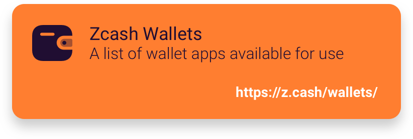
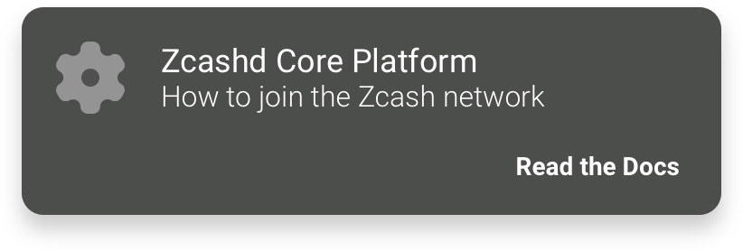
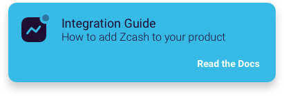
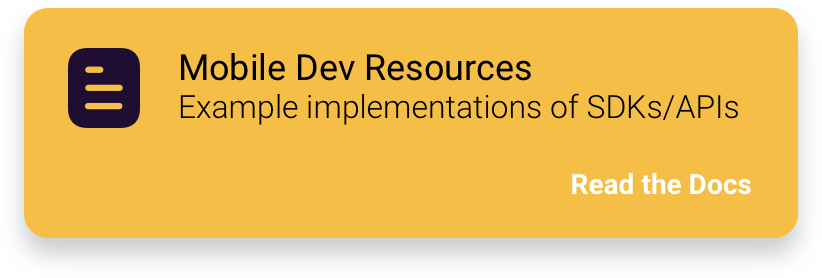
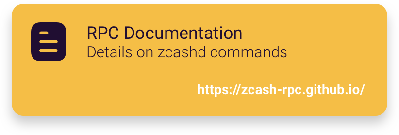

.. _root:

.. image:: rtd_pages/images/zcash-logo-horizontal-fullcolor.png
   :scale: 15
   :align: right

===================
Welcome to Zcash!
===================

This is the home for Zcash documentation for end users and developers. Check out our quickstarts, tutorials, API reference, and code examples. 

.. toctree::
   :caption: Introduction
   :hidden:

   rtd_pages/basics.md
   rtd_pages/ecosystem.md
   rtd_pages/librustzcash_arch.rst
   rtd_pages/best_practices.md

.. toctree::
   :caption: Interact with Zcash
   :hidden:

   rtd_pages/zcash_wallets.md
   rtd_pages/zig.rst
   rtd_pages/ECC_wallet.md
   rtd_pages/zcashd.md
   rtd_pages/protocol.md

.. toctree::
   :caption: Resources
   :hidden:

   rtd_pages/funding.md
   rtd_pages/learning.md
   rtd_pages/dev_tools.md
