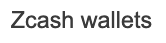
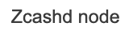
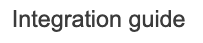
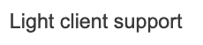
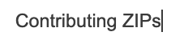
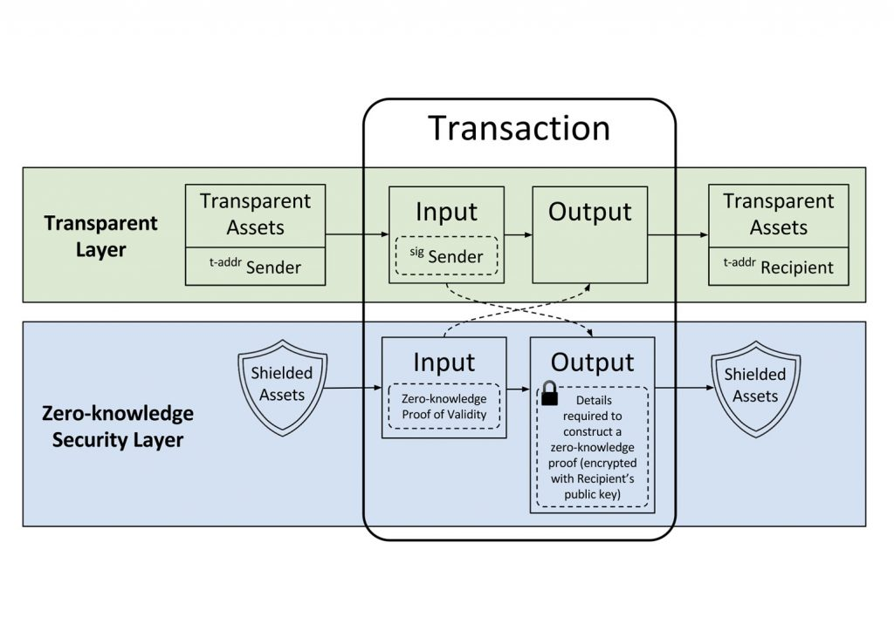
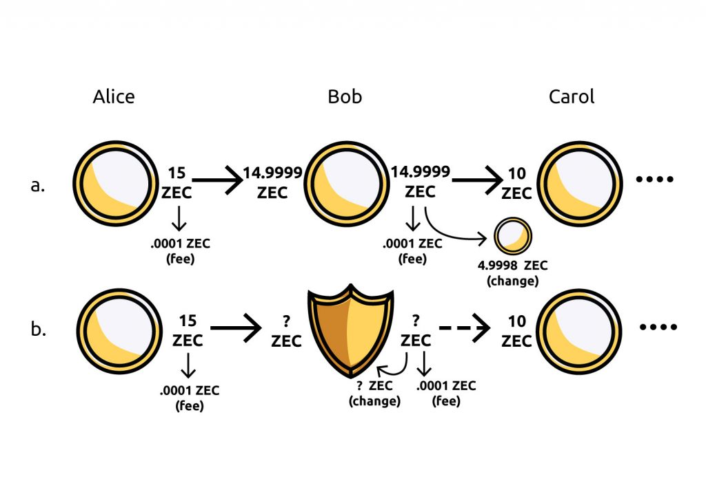

.. _root:

.. image:: rtd_pages/images/zcash-logo-horizontal-fullcolor.png
   :scale: 15
   :align: right

===================
Welcome to Zcash!
===================

This is the home for Zcash documentation for end users and developers. Check out our quickstarts, tutorials, API reference, and code examples. 

.. image:: rtd_pages/images/grid-rpc.png
   :width: 49%
   :target: https://zcash-rpc.github.io/

We encourage you to read :ref:`code_of_conduct` and :ref:`development_guidelines`. 

What is Zcash?
--------------

`Zcash <https://z.cash/>`__ is an implementation of the "Zerocash" protocol forked off Bitcoin. It is also used to refer to one unit of the cryptocurrency (ZEC), or Electric Coin Company (previously Zcash Company). 

The Zcash protocol, and therefore, using ZEC, can offer a far higher standard of privacy than Bitcoin or other privacy-focused cryptocurrencies. We achieve this through a sophisticated zero-knowledge proving confidentiality of transaction metadata. For more technical details, please check out our `Protocol Specification <https://github.com/zcash/zips/raw/master/protocol/protocol.pdf>`_.

Zero knowledge proofs mean that shielded zcash transactions reveal zero information to the public, and the least amount of information between sender and receiver. They know the amount you sent, the time, and the transaction ID, but not your address and other metadata (unless you disclose it). 

Other privacy schemes provide different, and less strict definitions of privacy.  Ring signatures used by Monero, only provide plausible deniability. Tumbler schemes, which mixes potentially identifiable currency with others to obsecure the souce, are insecure. 

.. _help:

Need Help?
----------

For immediate assistance, check out: 

* :ref:`glossary` of Zcash terms and concepts
* `FAQ <https://z.cash/support/faq.html>`_ covering basic use 
* :ref:`troubleshooting-guide` for debugging zcashd 

We'd also be happy `chat <https://discord.gg/PhJY6Pm>`_ with you. 

Join  the community! 
--------------------
Zcash development is an open collaborative process. We want contributors like you work along side Electric Coin Company, Zcash Foundation, partner companies, and active community members. 

There are lots of way to stay in touch: 

* `Zcash Dischord <https://discord.gg/PhJY6Pm>`_ for live chat and collaboration 
* `Zcash Community Website <https://www.zcashcommunity.com/>`_ for curation of news and resources
* `Electric Coin Company Blog <https://electriccoin.co/blog/>`_ for updates on zcashd and zcash protocol
* `Zcash Foundation Forumns <https://forum.zcashcommunity.com/>`_ for async discussion
* `Youtube channel <https://www.youtube.com/channel/UCPIPwZtZRCCW-x0dEKul8jA>`_ for quarterly live streams and media content

.. toctree::
   :caption: Using Zcashd
   :hidden:

   rtd_pages/user_guide.rst
   rtd_pages/install_debian_bin_packages.rst
   rtd_pages/install_binary_tarball.rst
   rtd_pages/troubleshooting_guide.rst
   rtd_pages/payment_api.rst
   rtd_pages/wallet_backup.rst
   rtd_pages/addresses.rst
   rtd_pages/sapling_turnstile.rst
   rtd_pages/zcash_conf_guide.rst
   rtd_pages/zcash_mining_guide.rst
   rtd_pages/security_warnings.rst
   rtd_pages/files.rst
   rtd_pages/tor.rst
   rtd_pages/glossary.rst

.. toctree::
   :caption: Developers & Contributors
   :hidden:

   rtd_pages/zig.rst
   rtd_pages/development_guidelines.rst
   rtd_pages/supported_platform_policy.rst
   rtd_pages/index_zips.rst
   rtd_pages/nu_dev_guide.rst
   rtd_pages/testnet_guide.rst
   rtd_pages/lightclient_support.rst
   rtd_pages/librustzcash_arch.rst
   rtd_pages/ux_wallet_checklist.rst
   rtd_pages/code_of_conduct.rst
   rtd_pages/dnsseed_policy.rst
   rtd_pages/insight_explorer.rst
