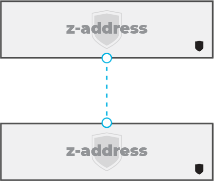
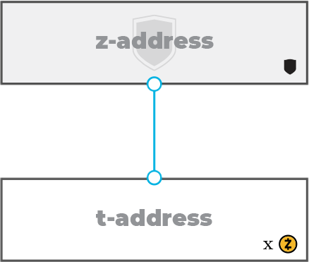
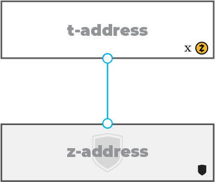
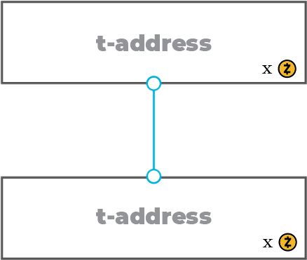
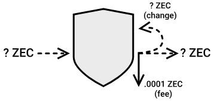

:orphan:

.. _zcash_addresses:

Addresses in Zcash
==========================

Overview
--------

Zcash has two main types of addresses: shielded (z-addresses which start with "z") and transparent (t-addresses which start with "t").

The Sapling network upgrade added a new type of shielded address to support the usability and security improvements. The new Sapling shielded addresses start with "zs" whereas the legacy, Sprout shielded addresses start with "zc". 

Example addresses:

    Sapling::

      zs1z7rejlpsa98s2rrrfkwmaxu53e4ue0ulcrw0h4x5g8jl04tak0d3mm47vdtahatqrlkngh9sly

    Legacy::

      zcU1Cd6zYyZCd2VJF8yKgmzjxdiiU1rgTTjEwoN1CGUWCziPkUTXUjXmX7TMqdMNsTfuiGN1jQoVN4kGxUR4sAPN4XZ7pxb

    Transparent::

      t14oHp2v54vfmdgQ3v3SNuQga8JKHTNi2a1

ZEC can be sent between transparent and shielded addresses. Therefore, there are four basic types of transactions:

   **Shielded/private** (Value is not revealed on the blockchain)

   **Deshielding** (Value is revealed on the receiver end)

   **Shielding** (Value is revealed on the sender end)

   **Transparent/public** (Value is revealed by both sender and receiver)
    
Shielded Addresses
------------------------------------------
	   
Shielded addresses are the address type that use zero-knowledge proofs to allow transaction data to be encrypted but remain verifiable by network nodes. Sapling shielded addresses are the primary shielded addresses as of the `Sapling network upgrade activation <https://z.cash/upgrade/sapling>`_. The legacy, Sprout addresses are still supported but will likely be deprecated in future. To learn about migrating from Sprout to Sapling addresses, see :ref:`sapling_turnstile` documentation.

   Shielded addresses and the values sent to or from them are not publicly visible.

:fa:`arrow-circle-right` A transaction between two shielded addresses (a shielded transaction) keeps the addresses, transaction amount and the memo field shielded from the public (with the exception of migrating funds between Sprout and Sapling shielded addresses).

:fa:`arrow-circle-right` Senders to a shielded address may or may not include an encrypted memo.

:fa:`arrow-circle-right` Recipients of a shielded or deshielding transaction do not learn about the senders address through the transaction recipt in their wallet. The receivers only learn the value sent to their address(es) and if receiving to shielded addresses, any encrypted memo that may have been included by the sender.

:fa:`arrow-circle-right` Many wallets do not include shielded address support yet but this is expected to change over time with the adoption of Sapling addresses.

:fa:`arrow-circle-right` Transaction fees are visible regardless of sending to and/or receiving from shielded addresses.

:fa:`arrow-circle-right` The transaction subsequent to a coinbase transaction (which is always to a transparent address) must be a shielding transaction.
    
HD Wallets
~~~~~~~~~~
Sapling addresses support a hierarchical deterministic wallet structure. This allows a master wallet seed to be used as a backup method for all Sapling addresses in a wallet. See the blog post, `Sapling in HD <https://z.cash/blog/sapling-in-hd/>`_ to understand more about how this feature is supported. Note that HD support is not enabled for Sprout or transparent addresses. 

Viewing Keys
~~~~~~~~~~~~

Viewing keys allow for the separation of spending and viewing permissions associated with shielded addresses. Users might want to give third-parties view access to their shielded addresses without also handing over spending capabilities or using a transparent address. For example, consider accounting or auditing use cases.

Currently, viewing keys are only partially supported in Sprout shielded addresses in the form of incoming viewing keys. This means, the viewing key will only be able to track incoming payments to a Sprout address. Sapling addresses do not have any viewing key support. This documentation will be updated when full Sapling address support is integrated.
   
Transparent Addresses
---------------------

Transparent addresses work similarly to Bitcoin addresses and do not offer privacy for users. 

   Transparent addresses and the values sent to or from them are publicly visible

:fa:`arrow-circle-right` At this time, some advanced features such as multisignature and the use of bitcoin-style scripting with opcodes are only supported by transparent addresses. Multisignature addresses start with a "t3" as opposed to the single signature standard address which start with a "t1". 
	   
:fa:`arrow-circle-right` Many wallets only support transparent addresses.
    
:fa:`arrow-circle-right` Coinbase transactions (AKA block rewards and miner fee payouts) can only be sent to transparent addresses.
   
Additional Reading
------------------

:fa:`arrow-circle-right` `Privacy Considerations for Official Zcash Software & Third-Party Wallets <https://z.cash/support/security/privacy-security-recommendations/>`_
    
:fa:`arrow-circle-right` `Anatomy of a Zcash Transaction <https://blog.z.cash/anatomy-of-zcash/>`_

:fa:`arrow-circle-right` `Transaction Linkability <https://blog.z.cash/transaction-linkability/>`_

:fa:`arrow-circle-right` `Selective Disclosure & Shielded Viewing Keys <https://z.cash/blog/viewing-keys-selective-disclosure/>`_
