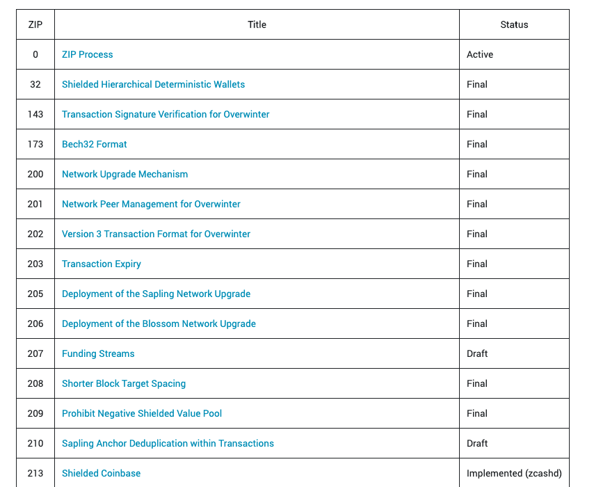

Zcash Improvement Proposals (ZIPs)
==================================

What are ZIPS? 
-------------

Zcash Improvement Proposals (ZIPs) are the way to: 

1) propose new features and  their rationale,
2) specify the implementation details of the feature,
3) collect community input on the proposal, and
4) document design decisions. 

Contributing ZIPs
-------------

The author(s) of the ZIP are responsible for building consensus within the community and documeting/addressing dissenting opinions. 

Anyone can write a ZIP! We encourage community contributions and decentralization of work on the Zcash protocol. If you'd like to bounce ideas before formally writing a ZIP, we encourage it! Visit the `community dischord channel <https://discord.com/invite/PXHqXV2>`_ to talk about your idea. 

Past and Current ZIPs 
---------------------

Visit the `zips website <https://zips.z.cash/>`_ for a detailed list of all ZIPs. 

