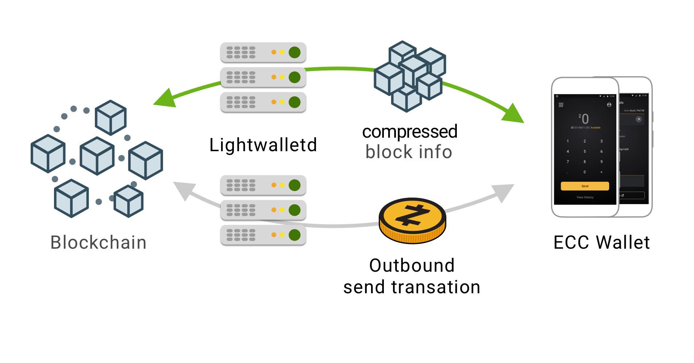

.. _lightclient_support:

Light Client Development
========================

*Last reviewed: July 2026*

The following resources allow development of apps and services that can transact on the blockchain without downloading an entire copy of the blockchain. A light client (also known as lightweight node) is referencing a trusted full node's copy of the blockchain, whereas a full node is a node that fully enforces all of the rules of the blockchain.

Lightwalletd 
------------
A stateless server that serves light clients with blockchain information. It fetches blockchain data from a Zcash full node (historically zcashd, which is `being deprecated <https://z.cash/support/zcashd-deprecation/>`_ in favor of `zebrad <https://github.com/ZcashFoundation/zebra>`_), processes them to reduce data, and stores it in a database. This allows light clients with different requirements to get relevant data without interacting with the full node directly. A Rust successor, `Zaino <https://github.com/zingolabs/zaino>`_, is being developed to provide a lightwalletd-compatible interface as part of the post-zcashd stack.

**Resources**

* `Lightwalletd source code <https://github.com/zcash/lightwalletd>`_
* `Lightwalletd instance setup guide <lightwalletd.html>`_
* `Lightwalletd API docs <../lightwalletd/index.html>`_

**Quick info**

* Parallelize-able, stateless, and containerized
* Can run virtually on the cloud (EC2, GCP, AZURE, Docker, etc.)
* Not using load balancers, orchestrators, schedulers (yet)
* Metrics, stress tests, and testing done (ask us)

Android 
-------
We maintain a SDK that allows for wallet functionalities (address management, send, receive, etc.), documentation of the APIs, and a demo app that exercises the SDK.

**Resources**

* `Android SDK source code <https://github.com/zcash/zcash-android-wallet-sdk>`_
* `Android Demo app <https://github.com/zcash/zcash-android-wallet-sdk/tree/main/demo-app>`_
*  `Android API docs <../android/zcash-android-wallet-sdk/index.html>`_

**Quick info**

* Native Android SDK and app, written in Kotlin
* Architecture: targeting ARM64, ARMv7 and x86
* APIs: minimum supported SDK version is API 27 (Android 8.1)

iOS 
---
We maintain a SDK that allows for wallet functionalities (address management, send, receive, etc.), documentation of the APIs, and a demo app that exercises the SDK.

**Resources**

* `iOS SDK source code <https://github.com/zcash/zcash-swift-wallet-sdk>`_
* `iOS Demo app <https://github.com/zcash/zcash-swift-wallet-sdk/tree/main/Example/ZcashLightClientSample>`_
* `iOS API docs <../ios/jazzy_docs/index.html>`_

**Quick info**

* Native iOS SDK and app, written in Swift
* Production-ready and at feature parity with the Android SDK; it powers `Zashi <https://z.cash/zashi/>`_, Electric Coin Company's flagship shielded wallet
* Targeting recent iPhones

Web (WASM)
----------

Browser-based light client development is active. `WebZjs <https://github.com/ChainSafe/WebZjs>`_ by ChainSafe is a JavaScript/TypeScript library (compiled from Rust to WASM) for interacting with the Zcash network from the browser; the same project powers a MetaMask Snap for shielded Zcash.

An earlier proof-of-concept demo web wallet from 2019 is preserved at https://github.com/str4d/zcon1-demo-wasm but is not actively maintained.

References
----------
* `Light client threat model <wallet_threat_model.html>`_
* `Contributing guidelines <https://github.com/zcash/zcash-swift-wallet-sdk/blob/main/CONTRIBUTING.md>`_
