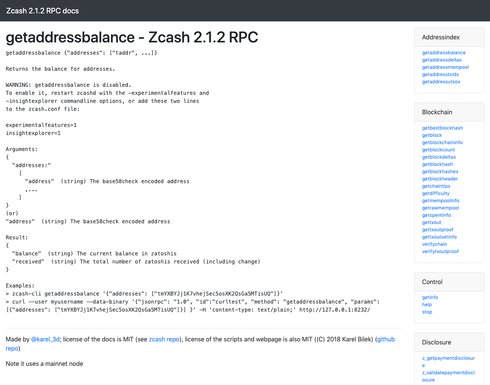

:orphan:
.. _payment_api:

Zcash Payment API
=================

Overview
--------

Zcash extends the Bitcoin Core API with new RPC calls to support private Zcash payments.

.. important::

   Zcash payments make use of **two** address formats:

   | ``taddr`` - address for transparent funds (similar to a Bitcoin address, value stored in UTXOs)
   | ``zaddr`` - address for private funds (zcash-specific, value stored in objects called notes)

   When a transaction only involves taddrs, you can use either the existing Bitcoin RPC calls or the Zcash RPC calls. When a transaction involves zaddrs, you must use the Zcash RPC calls.

Compatibility with Bitcoin Core
-------------------------------

* Zcash supports all commands in the Bitcoin Core API (as of version ``0.11.2``). 
* Zcash tries to maintain backwards-compatibility as best as it can.
* We do not recommend use of accounts, which are also deprecated in Bitcoin Core.  Where the account parameter exists in the API, please use ``""`` as its value, otherwise an error will be returned.
* To support multiple users in a single node’s wallet, consider using ``getnewaddress`` or ``z_getnewaddress`` to obtain a new address for each user.  Also consider mapping multiple addresses to each user.

Auto-updating API documentation
-------------------------------

We recommend this community-maintained |API|, which is automatically generated with a go script, and is updated with each major release. 

.. |API| raw:: html

   <a href="https://zcash.github.io/rpc/" target="_blank">Zcash Payment API documentation</a> 

