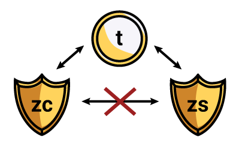

:orphan:

.. _sapling_turnstile:

Sapling Turnstile
==========================

Overview
--------

The Sapling network upgrade requires a new type of shielded address to support the new usability and security improvements it brings to Zcash. Sapling shielded addresses start with "zs" whereas the legacy, Sprout shielded addresses start with "zc".

The Sapling turnstile is an auditing mechanism for the number of ZEC in circulation. Shielded ZEC cannot be accounted for in the total monetary supply because balances remain private to the owners of shielded address private keys. The Sapling turnstile provides accounting for the ZEC held in Sprout shielded addresses as they are migrated to Sapling shielded addresses.

To achieve this, owners of shielded ZEC will be required to send their balances to a transparent address before sending to Sapling shielded addresses. Balance transfers from shielded addresses to transparent addresses reveal the value and become associated with the transparent addresses. Transfers from transparent addresses back into shielded addresses reshield the value.

Checking the Pool Totals
------------------------

It's possible to use your own node to check the total value in each shielded pool (Sprout and Sapling, currently) with a single RPC call to "getblockchaininfo". One way to issue that is to call `zcash-cli getblockchaininfo` on a computer running a properly-functioning zcashd. The resulting JSON blob contains the totals in the valuePool field.

Migration Tool
--------------

We plan to release a Sapling migration tool to help users who have funds stored in older Sprout addresses migrate them to a newer Sapling address.

If you are a user who stores funds in older Sprout addresses, we recommend you wait for this new tool before migrating your funds. We expect to release it in 2019 Q1.

The primary goal for development of this tool is protecting the users' privacy via automation to avoid human error or misunderstanding (yes, even advanced users). With that disclaimer, we are providing privacy recommendations below for users who are not going to listen to this advice and proceed with manual migration.

	   
Privacy Recommendations
------------------------------------------

There are several privacy recommendations that users should follow in order to retain privacy during a manual migration.

:fa:`arrow-circle-right` Use transparent addresses once for migrating shielded funds

  - Do not use transparent addresses which have already received funds.
  - Discard transparent addresses after migration is completed.
  - Use a unique transparent address for each balance migration.

:fa:`arrow-circle-right` Split balances into multiple migrations

  - Some users might prefer to not reveal the exact shielded balance in a single transfer.
  - Remember to use a unique, unused transparent addresses for splitting a balance across transfers.
  - A balance that is evenly divided across multiple migrations will have a higher chance of correlation..
  - Split balances will also have a higher chance of correlation the closer they are in block time. 

.. note::

   Splitting a shielded balance into multiple transfers is a matter of user preference and might not be the best approach for everyone. Using unused transparent addresses for the Sapling migration and discarding afterwards is **highly recommended for all users**.

   
Examples
--------

   Alice has a shielded balance of 14.6727 ZEC and doesn't want to reveal that a single address holds that exact value as she migrates to a new Sapling shielded address. She decides that paying six transaction fees to migrate is worth the cost to not reveal the total balance.

   To do this, Alice generates 3 new transparent addresses ``t1abc...``, ``t1def...`` and ``t1xyz..`` and picks 3 unequal values that add up to her total balance ``10``, ``4.0001`` and ``0.6756``.

   She initiates the first transaction, to the first fresh transparent address revealing 10 ZEC in address ``t1abc...``. This leaves 4.6726 ZEC in the legacy address accounting for the first transaction fee. Once confirmed, Alice sends 9.999 ZEC (accounting for the second transaction fee) from ``t1abc...`` to her new shielded Sapling address.

   She waits a couple of hours before initiating the second transfer, revealing 4.0001 ZEC in address ``t1def...``. This leaves 0.6724 ZEC in the legacy address accounting for the third transaction fee. Once confirmed, she finishes the second transfer by sending 4 ZEC (accounting for the fourth transaction fee) to the same Sapling address. The balance in the shielded Sapling address is now 13.999 ZEC.

   She waits for the next day to initiate the third and final transfer, revealing 0.6723 ZEC (accounting for the fifth transaction fee) in address ``t1xyz...``. Once the transaction is confirmed, the legacy Sprout address is now empty and a may be discarded. She finishes the final transfer by sending 0.6722 ZEC (accounting for the sixth transaction fee) to her Sapling address which now has a balance of 14.6721 ZEC (the original balance minus six transaction fees).

.. note::

   If fees are not a concern, users are advised to split balances transactions which send values in powers of ten (.001, .01, .1, 1, 10, 100, 1000, etc.). A user with a balance of 139.34 ZEC using this method would migrate 100 ZEC once,10 ZEC three times,1 ZEC nine times,.1 ZEC three times and .01 ZEC four times. This adds up to 20 migrations and 40 transactions. At the default fee rate (.0001 ZEC per transaction) this would cost .004 ZEC.

   If time is not a concern, users are advised to delay migrating their split balances over intervals of time that are sufficiently random (between 2 and 100+ hours). A user with 40 transactions to complete their migration of 20 balances using this method could pick 40 random hour intervals in which to send the transactions.
   
Additional Reading
------------------

:fa:`arrow-circle-right` `Sapling Addresses & Turnstile Migration <https://blog.z.cash/sapling-addresses-turnstile-migration/>`_

:fa:`arrow-circle-right` `Anatomy of a Zcash Transaction <https://blog.z.cash/anatomy-of-zcash/>`_

:fa:`arrow-circle-right` `Transaction Linkability <https://blog.z.cash/transaction-linkability/>`_
