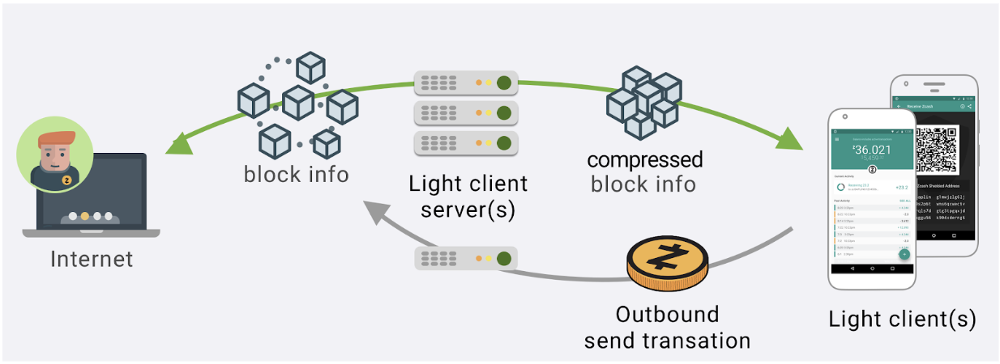
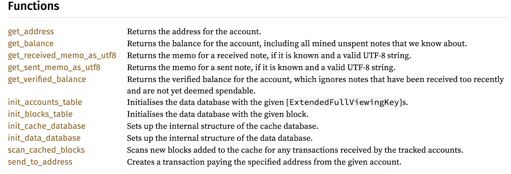
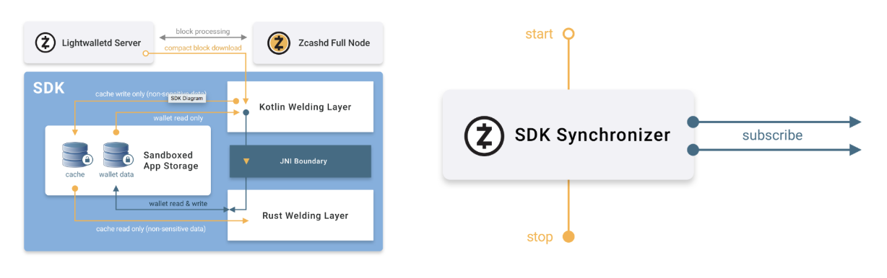

.. _shielded_support:

Shielded Support Resources
==========================

Everything you need to integrate and support zcash shielded addresses into your light wallet.

**Resources are at a proof-of-concept stage and is subject to breaking changes at any time.**

Librustzcash
------------
Latest working branch: https://github.com/str4d/librustzcash/tree/note-spending-v5 

A set of APIs that collectively implement an SQLite-based light client for the Zcash network. Compiles for Android, iOS, and JS web apps.

Objectives

1. separate out zcash-specific on-wallet cryptographic functionalities into a module and expose it via an API
2. maintain for third parties, handing updates from releases to zcashd, network upgrades for the Zcash 

Notes

* Communicates with a light wallet via shared SDK. 
* Works on testnet and mainnet. 
* Only handles Sapling shielded addresses and transactions, not compatible with Sprout shielded addresses or transactions. This is on purpose, as Spout addresses are retired.

It has documentation that you can build and view with the following commands: 

``git clone https://github.com/str4d/librustzcash.git``

``cd librustzcash``  

``git checkout note-spending-v5`` 

``cd zcash_client_sqlite``  

``cargo +nightly doc --all --open``  

You may need to run this command first to get the doc to open:  

``rustup toolchain install nightly``

Or alternatively, you can open docs the latest stable doc (not nightly build): 
	
``cargo doc --all --open``

Lightwalletd 
------------
https://github.com/zcash-hackworks/lightwalletd/ 

A stateless server that light clients pull relevant data from. It fetches blockchain data from zcashd, processes them to reduce data, and stores it in a database.

Objectives

* Cache Zcash compact blocks to serve to multiple light clients on demand 
* Pre-processes Zcash blocks to save bandwidth for light clients 
* An adaptive layer that will allows light clients with different requirements to get relevant data without interacting with zcashd directly 

How blocks are pre-processed:

* Drop extra information from blocks without sapling inputs or outputs (drops ~95% of blocks)
* Drop any header information that is not relevant for a light client functionalities (5% of a block); i.e. a light wallet does not need to validate the blockchain. 
* Drop the memo field (70% of the block), which is currently rarely used. This renders validation functions invalid, but this is not relevant to light clients. 

Android SDK 
------------
https://github.com/zcash/zcash-android-wallet-sdk/tree/preview  

A lightweight SDK that consumes data from librustzcash and exercises librustzcash to send and receive shielded transactions.

For an overview of the Android SDK, see the `android sdk readme <https://github.com/zcash/zcash-android-wallet-sdk/tree/preview>`_. The synchronizer is the primary interface for interacting with the SDK. It exposes an API and the set of functions which can be found on this github `synchronizer readme <https://github.com/zcash/zcash-android-wallet-sdk/blob/preview/docs/-synchronizer/README.md>`_.

Objectives

* Demonstrate how to interact with lightwalletd and librustzcash
* Showcase design best practices from ECC around Zcash specific features
* Optimize for efficiency leveraging Android-specific best practices

Known issues 

* The latest developer preview code lives in the preview branch. Always use the preview branch even for documentation, master is behind. (This is due to a lack of engineers that can code review in house, we're hiring to fix this.)
* This has not yet been published to a package manager (bintray).  

iOS SDK  
-------
This does not exist yet, but is planned work. We hired an iOS developer on August 26th, 2019! 

Note: librustzcash can be compiled on iOS, so a motivated development team can currently make an iOS shielded app happen! What we're working on are supportive resources and reference code. 

WASM framework 
--------------
https://github.com/str4d/zcon1-demo-wasm 

A minimal functioning demo web wallet. This is not officially maintained.  

Objectives
* Target desktop OSes and allow them to use shielded addresses
* Separate out web-specific wallet functionalities
* Allow web browsers to talk to gRPC servers, via a proxy (cannot talk directly)

FAQ
---

Librustzcash 
^^^^^^^^^^^^
Do I need to import the entire Rust standard library?
	There is a base overhead when including Rust code in non-Rust binaries, but what gets compiled in is (roughly) only what the Zcash Rust code actually uses. 
What is the smallest size that this can be? 
	We have not tested this yet. 
Has this code been audited? 
	Yes, internally and externally.  For more information, read the blog post: https://electriccoin.co/blog/blossom-network-upgrade-and-wallet-security-audits/. We have not addressed all the issues from the audits, but none of the outstanding issues were marked as high priority. 
How is this related to/communicating with zcashd? 
	zcashd calls into the librustzcash library for some functions, which depends on the same core Zcash Rust libraries as zcash_client_sqlite. librustzcash.h is the API used by zcashd.
How is this related to the Android SDK?  
	The Android SDK uses zcash_client_sqlite’s API to get balances, update balances, scan for blocks, and send memos (see full list of functions above). There is a thin “welding layer” between zcash_client_sqlite and the Android SDK that allows this communication. 
How is this related to lightwalletd? 
	Lightwalletd is abstracted away, and they commuicate only via two SQLite databases: 1) A cache database, used to inform the light client about new CompactBlocks. It is read-only within all light client APIs except for [init_cache_database] which can be used to initialize the database. 2) A data database, where the light client's state is stored. It is read-write within the light client APIs, and assumed to be read-only outside these APIs. Callers MUST NOT write to the database without using these APIs. Callers MAY read the database directly in order to extract information for display to users.

Lightwalletd
^^^^^^^^^^^^

How is this related to the Android SDK?
	It pre-processes blocks so that information not necessary for light clients is dropped, but burdens the Android SDK to process the information further for its specific implementation. 
How is this related to librustzcash?
	It does not need to know about librustzcash.  
What is the threat model? 
	We assume that the full-sized zcash blocks given to lightwalletd are correct, that light clients ask for things that they need and honestly (no DDoS or malformed request protections), and that t the Zcash network is more or less stable (reorgs, forks, etc. cause some disruption and in severe cases malfunction).  
Can I run this on an EC2 instance? 
	Yes. 
Are you using containers? 
	Yes.
Are you using an orchestrator/scheduler? 
	Not yet. 
Are you using load balancers? 
	Not yet.
Can we run many instances and use a load balancer? 
	Yes! It’s designed to be stateless and work with a load balancer 
What are the expected costs? 
	We have not estimated the costs yet. 
What database are you using? 
	SQLite, but it’s not required. Using another database will require modifications to the lightwalletd codebase, though. 
How do you handle testing and lifecycle? Do you have a CI/CD pipeline?
	We are actively updating the test stack and lifecycles. We do not have a CI/CD pipeline yet, but MRs are in place. 
How do you handle logs?
	We look at them on an as-needed basis. 
What metrics stack do you use, if any?
	We don’t have one. 

Android SDK
^^^^^^^^^^^

What resources are available? 
	We have two sample apps: addressAndKeys and memo. The former shows what’s necessary for receiving funds. The latter shows the bare minimum for sending.  We also have two full demo apps: the reference wallet, Zcon1 swag app. 
What does SDK not do?  
	We purposefully leave key management, import, export, seed generation to the specific third party wallets because our partners have told us these things are what their wallet apps do best. We have yet to implement: visibility into incoming memos, background operations that extend beyond the life of the app (not using workmanager yet), modularization of dependencies (make it easier to plug and play different tech stacks for networking, persistence, etc.).
What is the threat model? 
	We trust lightwalletd to be an honest server and to perform all computations correctly. We assume that the network adversary is passive. We do not handle key management, backup seeds, import, or export (leaving that to the specific wallet developer).
How is this related to librustzcash?
	It shields librustzcash from needing to know about lightwalletd, and gives it the data it needs for the computation it needs. 
How is this related to lightwalletd? 
	It is the only thing that needs to know how about lightwalletd’s existence and interacts with it directly. It synchronizes compact blocks and persists them on the phone for librustzcash to use. 
What are your minSdk and targetSdk versions?
	We support API 16 and above for certain chip sets but we optimize for API versions 21 and above. We currently target API 28 and will update to 29 (Android Q) once it is out of beta.
What architectures are you targeting?
	Currently we’re targeting ARM64, ARMv7 and x86. 
Which steps do you require for keeping your play store app size small? Do you use APK splitting, ABI filtering, proguard, etc.?
	We do not release an app on the play store, our reference is app is for learning purposes and we do not use APK splitting, ABI filtering, or proguard. 
What Android networking libraries/utilities do you use?
	Grpc and Protobufs. 
Are you doing cross-platform development i.e. sharing code with iOS/Web via things like C, kotlin, rust, or react?
	No. 
Do you use Kotlin coroutines, channels, RxJava, etc?
	Yes, we make heavy use of coroutines which can adapt to support RxJava.

