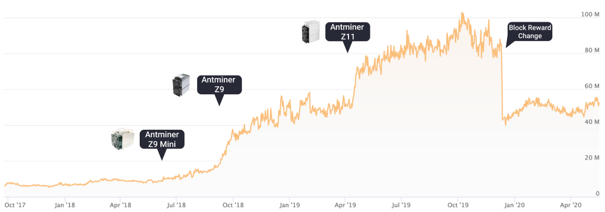
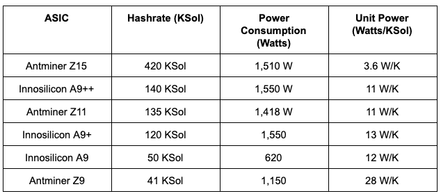
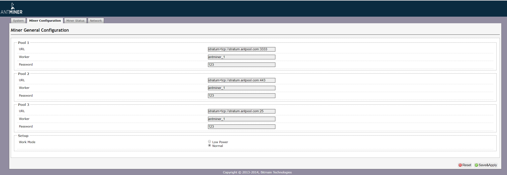

:orphan:

.. _zcash_mining_guide:

Zcash Mining Guide
==================

Welcome! Want to earn Zcash while strengthening the security of the Zcash network? Whether you are a hobbyist or a professional, mining is a great way to do it. Given the current network difficulty you must use an ASIC to mine Zcash.

Thanks to `Luxor <https://mining.luxor.tech/>`_ for assistance with this mining guide. 

In this guide we cover:

* Overview of the Zcash mining process
* Calculating rewards
* Purchasing specialized hardware (ASIC)
* Finding a hosting solution for your hardware
* Setting up your ASIC
* Choosing and configuring a mining pool 
* Setting up a Zcash wallet

Overview
--------
Like many blockchains, transactions on the Zcash network are secured using a cryptographic method known as Proof of Work (PoW). In this process, application-specific computers compete to find a solution to a difficult mathematical problem defined by the Equihash hashing algorithm. As a result of performing this work, miners are rewarded with newly minted coins. 

Just over 2 years ago, Equihash coins were being mined solely by GPUs. Since the release of the Antminer Z9 mini, more and more ASICs have been deployed to the network achieving a staggering 10x growth. A chart below shows the growth of the Zcash network difficulty with popular ASIC releases.

Calculating rewards
-------------------

Zcash mining economics can be distilled down to three inputs: revenue, operating expense & capital expenditure. 

On the revenue side, you can check out the `current profitability <https://whattomine.com/asic>`_ using many publicly-available mining calculators. At the time of writing this guide, 1Msol of hashpower generates $55 in revenue a day. The next thing to do is to predict how this will change over the investment horizon (2-3 years). Usually, you want to assume some increase in network difficulty (decreasing the revenue) and make a prediction on the price of Zcash. Also, make sure to factor in changes to the block reward to miners. 

On the operating expense side, this is largely dependent on your electricity cost. It is crucial that you source cheap electricity to use to power your equipment. As of 2020 you ideally want to pay less than 7-8 cents USD per kWh.

By leveraging expertise in equipment procurement, operating with low-cost power, and more, miners can generate solid risk-adjusted returns, in many cases over that of Bitcoin mining.

Purchasing an ASIC
------------------

ASIC stands for Application-Specific Integrated Circuit and describes a type of processor that is designed for a single purpose. ASICs are a popular choice for mining cryptocurrency because they can offer higher efficiency than CPU or GPU miners. 

Please note that the information on this page may become obsolete due to the rapidly changing market. Make sure to do your own proper due diligence into any machine listed below.

The following Equihash ASIC miners are available on the market today:

Going direct to the manufacturer is an option for the latest-gen machines:

* Bitmain: https://www.bitmain.com
* Innosillicon: https://www.innosilicon.com

ASIC resellers may also have miners available:

* Blockware Mining: https://www.blockwaresolutions.com

ASIC hosting
------------

Some miners host ASICs in their own home if they have a good shed or basement. They also usually only do this in smaller volumes due to power constraints. ASICs can be intrusive in your home as they are extremely loud when operating (think a vacuum cleaner). In addition, mining hardware consumes a very significant amount of electricity, so running multiple mining ASICs in your home may damage your wiring or fuse board. It is key to understand these risks ahead of hosting an ASIC at home. 

Depending on the considerations above and your electricity rate, it could make sense to send your ASICs to a mining hosting site. The hosting business takes a “hosting fee” in return for setup, ensuring proper operations, electricity and ongoing maintenance.

There are many hosting options available in the US / Canada which can be found in a database `here <https://hashrateindex.com/farms>`_. This database contains some of the top facilities like Blockware, Compute North, Core Scientific, Frontier, Box Miner, and many more.  Please make sure to do your own research before making any decision on engaging a colocation business.

ASIC setup
----------

* **Powering up the Miner**: Connect your machine to the power outlet via the built-in PSU. Then connect your miner to your internet-connected router or switch using a standard network cable. You are now ready to power up your miner.

* **Scanning for Devices**: To get started, use a scanning tool like `AngryIP <https://angryip.org/>`_ or `Locator <https://minerstat.com/software/locator>`_ to scan every device on your local network and see its IP address. After you have identified your miner’s IP address, you are ready to proceed with Configuration.

* **Configuration**: Enter the local network IP address of your miner in the URL bar of any web browser. A dashboard similar to the one shown below will pop up. 

Joining a mining pool
---------------------

* **Joining a pool**: We highly recommend joining a mining pool rather than mining solo. It provides a more steady income stream based on the hash rate contributed, rather than only getting paid when your ASIC mines a block. In choosing a mining pool, you can consider the size of the pool, payout methods (PPS vs PPLNS), pool fee, geographic location of the pool, ping time to the server, user interface, statistics / data, and customer support. Ultimately you want to find a pool that can be trusted, has high payouts and a great user experience. 

We recommend the following mining pools, which are asic-compatible *and* support payment out to shielded addresses: `Luxor <https://mining.luxor.tech/>`_, `Bitfly <https://zcash.flypool.org/>`_, and `Slushpool <https://slushpool.com/>`_.   

* **Completing Configuration**: Once you have created a user account with a chosen mining pool, you will need to complete the setup process at the specific mining pool so that the ASIC is registered as a mining participant in the mining pool. We recommend that you contact the chosen mining pool directly with any assistance. 

* **Monitoring Results**:  Each mining pool will have a different monitoring dashboard. Once set up, you should be able to see how much you are contributing to the mining pool, the status of the ASIC miner, and the estimated payout for the work. 

Getting payment
---------------

The last step is to set up a Zcash wallet and corresponding zcash address to receive payouts. If you do not have one set up yet, we have a list of recommended wallets `here <https://z.cash/wallets/>`_. 

Once you have your address, navigate to the settings or account details page in the respective mining pool’s interface, and add the address to pay out to. Commonly, payments are paid out either periodically or after a certain threshold of ZEC has been earned. What you chose is up to you, but we encourage you to be paid out to a zcash shielded address for enhanced privacy, if the mining pool supports this feature. 

