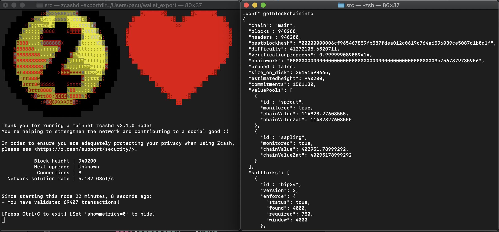

# Zcash Full Node and CLI

Zcashd & Zcash-cli allow you to run a full node and interact with it via a command-line interface. The zcashd full node downloads a copy of the Zcash blockchain, enforces rules of the Zcash network, and can execute all functionalities. The zcash-cli allows interactions with the node (e.g. to tell it to send a transaction).



Zcashd & Zcash-cli are maintained by Electric Coin Company (the founding team for Zcash).


## Install

* [Docker](https://hub.docker.com/r/electriccoinco/zcashd) (containerized DebianOS)

* [Debian/Ubuntu](Debian-Ubuntu-build.html) ([officially](https://zcash.readthedocs.io/en/latest/rtd_pages/supported_platform_policy.html#supported-platform-policy) supported) *[Debian Jessie support ends on Oct 1st 2020.](https://forum.zcashcommunity.com/t/end-of-debian-jessie-support-is-on-october-1st-2020/37313)*

* [Other Linux Systems](https://zcash.readthedocs.io/en/latest/rtd_pages/Linux-misc-build.html) ("best-effort" supported)

* [macOS](macOS-build.html) ("best-effort" supported)

* [Windows](windows-build.html) (unsupported)


## Configuration

Zcashd requires a zcash.conf file to run.

A blank zcash.conf file will run with all default settings. To generate one, run:

```
mkdir -p ~/.zcash
touch ~/.zcash/zcash.conf
```

Zcashd can be configured in various ways to suit different use cases; see the [Zcash.conf guide](zcash_conf_guide.html) for an extensive list of options.

## Use

Now, run zcashd!

```
./src/zcashd
```

If you are running Zcash for the first time, the Zcashd node needs to fully sync before using the RPC. This may take a day or so.

With a fully-synced running ``zcashd`` in the background, open a new terminal window and run:

```
./src/zcash-cli getinfo
```

See the available [RPC commands](https://zcash-rpc.github.io/) for all the capabilities of Zcashd & Zcash-cli.

Try generating some addresses, then sending and receiving transparent and shielded transactions! Note that there are separate commands for transparent and shielded addresses/transactions.

If you're running Zcashd for development, configure Zcashd to run on testnet, which takes significantly less time to sync than mainnet. Use the [Zcash Testnet Faucet](https://faucet.testnet.z.cash/) to get test funds.

## Upgrading

<!--If you're on a Debian-based distribution, you can follow the :ref:`install-debian-bin-packages-guide` to install Zcash on your system. -->
If you use zcashd but have not upgraded within 16 weeks of a release, it will reach the end-of-support (EOS) halt and exit with an error message. See the [release cycle](https://z.cash/support/schedule/) for details.

The node gives a warning two weeks in advance if you have the metrics screen enabled (and if there are no other overriding errors). A getdeprecationinfo RPC call will also return the block height at which the node will halt.

To upgrade Zcashd & Zcash-cli, fetch the latest updates:
  ```
   git fetch origin
  ```

Helpful tips: 
* Upgrading to v4.3.0 requires a build; try the following: 
  ```
  git checkout v4.3.0
   ./zcutil/clean.sh
   ./zcutil/build.sh -j$(nproc)
  ```
* Run Zcashd again and verify that the version number matches that of the [source repository](https://github.com/zcash/zcash).
* If parameters need re-running, try ``./zcutil/fetch-params.sh``. This is unlikely, and the node should tell you if this is necessary.
* If you don't have ``nproc``, try ``sysctl -n hw.ncpu`` on macOS or if the build runs out of memory, try again without the ``-j`` argument,  just ``./zcutil/build.sh``.
* If you run into issues upgrading, please see the [Network Upgrade Guide](nu_dev_guide.html).

## References

An extensive list of Zcashd & Zcash-cli pages, including ones linked inline in this page above.
* [Zcash RPC Commands](https://zcash-rpc.github.io/)
* [Zcash.conf guide](zcash_conf_guide.html)
* [Troubleshooting Guide](troubleshooting_guide.html)
* [Wallet Backup Instructions](wallet_backup.html)
* [Sending Memos with Zcashd](memos.html)
* [Zcash Mining guide](zcash_mining_guide.html)
* [Known Issues](security_warnings.html)
* [Data Directory Files](files.html)
* [Tor Support in zcashd](tor.html)